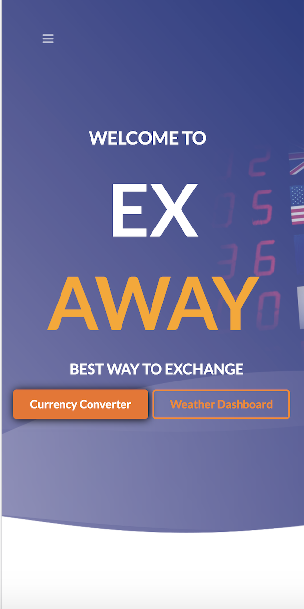
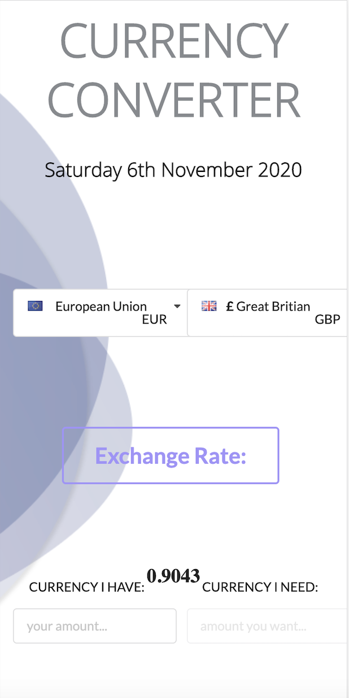
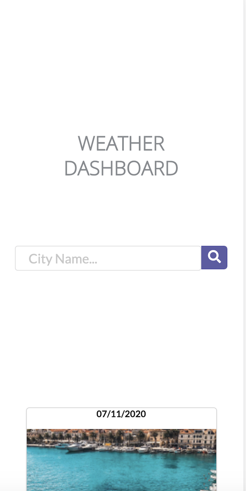
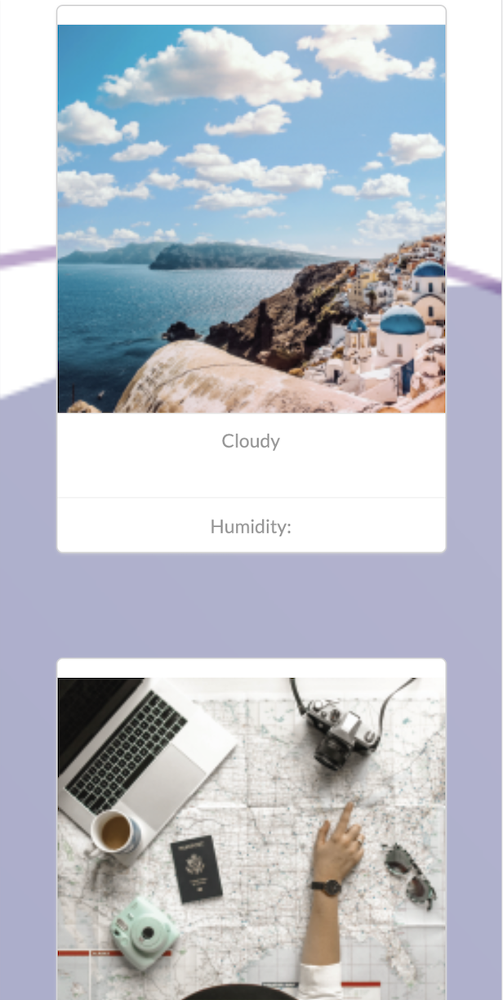
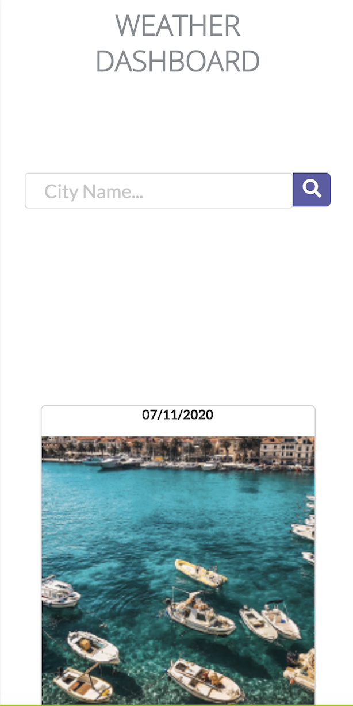
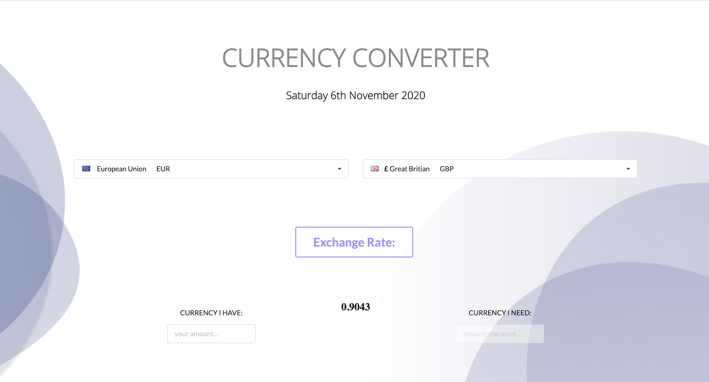
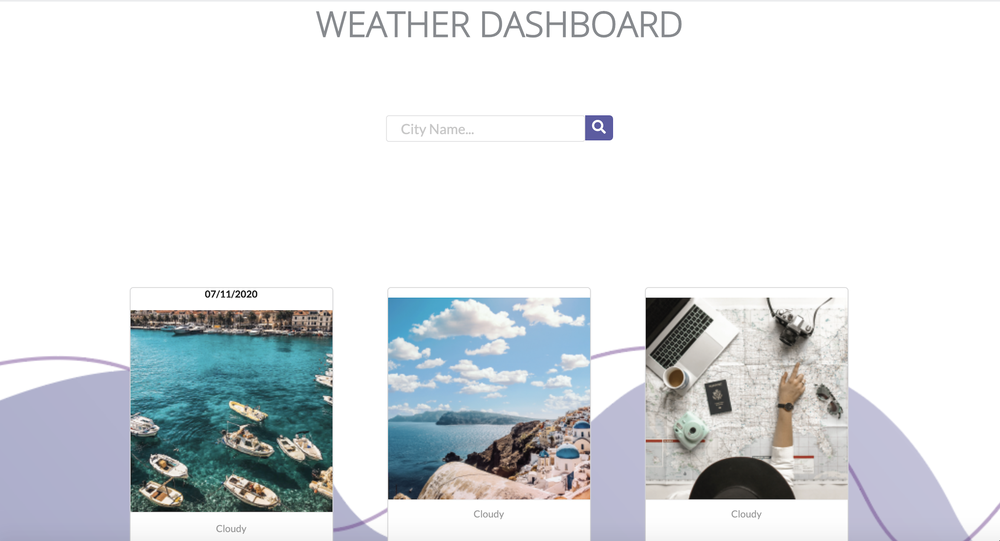
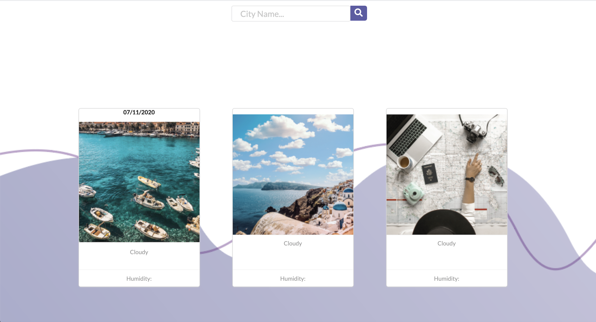

## Group 1:
Rekha Kumari. Nikstar-1

Sumaya Hassan. Sumaya198

## Project Title: 
Exchange Away (EX Away – The best way to exchange).

## Website Title and Description
Exchange-Away website will give you the best way to exchange your money, and save your valuable time when you travel. This is the core functionality we are offering. However, we are integrating this feature with the weather forecast as an extra feature made available to our prospective users to enable them get first hand up-to date weather information to where they are visiting.

The website can be found at the following address ...https://nikstar-1.github.io/exchange-away/.
## Who is our audience? 

Tourists. But can be used by other people (business / holiday makers etc).
## User Story: 

As a tourist 
I want to see currency rates.
So that I can prepare for my travel well ahead by exchanging the money needed.

## What is the problem the product is going to address? 
Currency needs with additional extra features like the weather forecast, to help users on their travels.

## How does the product solve the problem?
Quickly, and effectively by giving the user direct access to a handy tool allowing them to convert their budget. Additionally, they will also see the weather in the country they will be travelling to.  

## Acceptance Criteria:
GIVEN a currency with form inputs.

WHEN I select my currency from dropdown.

WHEN I select the currency I want to convert to.

WHEN I enter the amount of money I have to convert.

THEN I am presented with local currency rates for that country.

THEN I am presented with the equivalent amount I will be getting based on exchange rate.

WHEN I select the rates, I am able to store my search in the local history to refer back to.

THEN I scroll down, and input the city to where I'm travelling.

THEN I am presented with the weather forecast for that country. 

## Motivation
The motivation to build this website has come from myself, and Sumaya being frequent travellers ourselves. We wanted to build a website that will conviniently exchange our money to the local currency. We believe our website will help all users plan ahead, and effectively search major currencies. We want to help users by giving them a convinient tool which is accurate and instant. 

## What were the technologies used?
The technologies used are Semantic UI as our framework, we chose this particular framework because it has a lot of building tools for example, incorporated flags, side bar, currency symbols menu/nav bar. 
We used exchangeratesapi.io to get currency API's and we used openweathermap.org to get daily weather information.

## Tasks 
Tasks were assigned to Sumaya for design, Sumaya198 came up with a design in desktop and mobile version, and the weather map.
I, Nikstar-1, concentrated on the function of the currency converter. 

To check the progress of these tasks we used Git Hub Project board - we tracked progress on there and marked completed tasks. 

## Challenges 
Nikstar-1
The challenges I encountered on the way were to get the flags and currency in the same drop down. Another, was identifying the right API - We has a list of API's one of them were giving all currency rates in a single request, another one giving rates for two currencies specified in request. So, i needed to fix an approach, whether to get all rates in a single request, and store them to use later or get the rates after selecting currency.
## Success's
Nikstar-1
To achieve all results in my browser, and see the funtionality come together.

## Challenges 
Sumaya198 
The challenges I faced in the project was getting the sidebar to work. It required extra components and learning the semantic ui framework to ensure the webpage was responsive on all devices. 

## Success's
Sumaya198
I am proud of the way we worked together and produced a beautiful website that we can update and improve at a future date.

## Directions for future development
Incorporate Rate alerts
Travel expenses calculater
Currency email updates
Live currency board
Live Weather Board

### Exchange-Away

#API's
https://openweathermap.org/current
https://exchangeratesapi.io/
http://fixer.io/
https://currencylayer.com/documentation

#css
https://semantic-ui.com/collections/menu.html

## Screenshots:

**Work Main Mobile UI.**

**Currency Converter complete page.**

**Weather Dashboard sample.**

**Currency Converter complete page.**

**Work Weather Continued.**

**Ex-Away Desktop sample.**

**Currency Converter Desktop.**

**Weather Dashboard Desktop.**

**Weather Dashboard 4 sample.**

----------------------------------------------------------------------------------------------------------------------------------------------------------------------------

## Project Requirements
- Must use at least two server-side API's
- Must use a css framework
- Must use client-side storage to store persistent data
- Must have a polished, mobile-first UI
- Must meet good quality coding standards (indentation, scoping, naming etc.)
- Does not use alerts, confirms, or prompts
- Must be deployed to GitHub Pages
- Must be interactive(i.e accept and respond to user input)

## Project Metrics 
The project will be evaluated on the following:
Technical criteria 
Concept
Deployment
Repository Quality
Application Quality
Presentation
Collaboration
